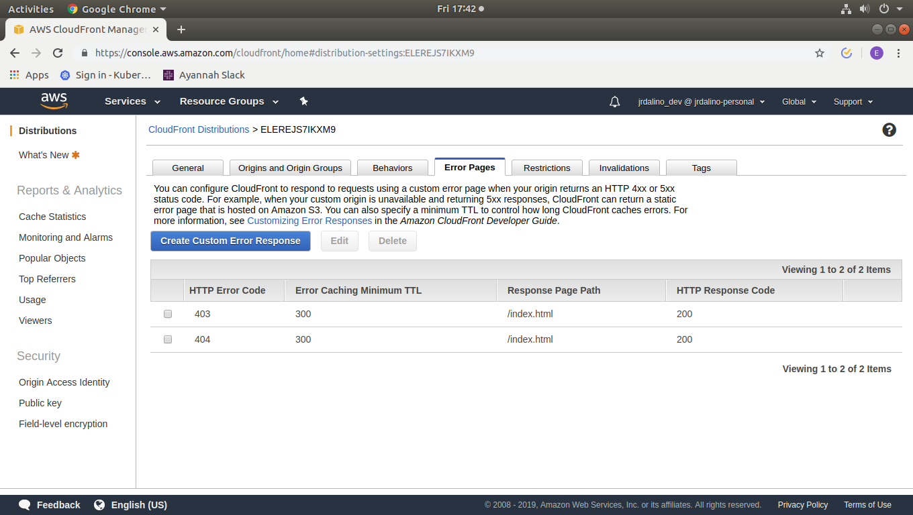

# My Project Frontend Deploy To S3 & Cloudfront

## Step 1: Deploy Frontend

### Step 1.1: Note: If backend is already ready, replace http://localhost:5000 url with ELB Endpoint Ex. http://a529520be6d7811e98ef812788873e53-1902855455.us-east-1.elb.amazonaws.com/
```
$ vi ~/environment/myproject-consumer-web/<REPLACE_ME>.js
```

### Step 1.2: Create an S3 Bucket for Storing Content
```
$ aws s3 mb s3://jrdalino-myproject-consumer-web
```

### Step 1.3: Create a CloudFront Access Identity
```
$ aws cloudfront create-cloud-front-origin-access-identity \
--cloud-front-origin-access-identity-config CallerReference=MyProjectConsumerWeb,Comment=MyProjectConsumerWeb
```

### Step 1.4: Create the S3 Bucket Policy Input File
```
$ mkdir aws-cli
$ vi ~/environment/myproject-consumer-web/aws-cli/website-bucket-policy.json
```
```
{
    "Version": "2008-10-17",
    "Id": "PolicyForCloudFrontPrivateContent",
    "Statement": [
        {
            "Sid": "1",
            "Effect": "Allow",
            "Principal": {
                "AWS": "arn:aws:iam::cloudfront:user/CloudFront Origin Access Identity EUUQAM3AZAFRN"
            },
            "Action": "s3:GetObject",
            "Resource": "arn:aws:s3:::jrdalino-myproject-consumer-web/*"
        }
    ]
}
```

### Step 1.5: Add a public bucket policy to allow CloudFront
```
$ aws s3api put-bucket-policy \
--bucket jrdalino-myproject-consumer-web \
--policy file://~/environment/myproject-consumer-web/aws-cli/website-bucket-policy.json
```

### Step 1.6: Publish the Website Content to S3
Before publishing, run the following commands:

```
$ cd ~/environment/myproject-consumer-web
$ npm run build
```

Copy the files in the dist folder into your s3 bucket
```
$ cd ~/environment/myproject-consumer-web/dist
$ aws s3 cp . s3://jrdalino-myproject-consumer-web/ --recursive
```

### Step 1.7: Create the CloudFront Distribution input file
```
$ cd ~/environment/myproject-consumer-web
$ mkdir aws-cli
$ vi ~/environment/myproject-consumer-web/aws-cli/website-cloudfront-distribution.json
```

```
{
  "CallerReference": "MyProjectConsumerWeb",
  "Aliases": {
    "Quantity": 0
  },
  "DefaultRootObject": "index.html",
  "Origins": {
    "Quantity": 1,
    "Items": [
      {
        "Id": "MyProjectConsumerWeb",
        "DomainName": "jrdalino-myproject-consumer-web.s3.amazonaws.com",
        "S3OriginConfig": {
          "OriginAccessIdentity": "origin-access-identity/cloudfront/EUUQAM3AZAFRN"
        }
      }
    ]
  },
  "DefaultCacheBehavior": {
    "TargetOriginId": "MyProjectConsumerWeb",
    "ForwardedValues": {
      "QueryString": true,
      "Cookies": {
        "Forward": "none"
      }
    },
    "TrustedSigners": {
      "Enabled": false,
      "Quantity": 0
    },
    "ViewerProtocolPolicy": "allow-all",
    "MinTTL": 0,
    "MaxTTL": 0,
    "DefaultTTL": 0
  },
  "CacheBehaviors": {
    "Quantity": 0
  },
  "Comment": "",
  "Logging": {
    "Enabled": false,
    "IncludeCookies": true,
    "Bucket": "",
    "Prefix": ""
  },
  "PriceClass": "PriceClass_All",
  "Enabled": true
}
```

### Step 1.8: Create CloudFront Distribution
```
$ aws cloudfront create-distribution \
--distribution-config file://~/environment/myproject-consumer-web/aws-cli/website-cloudfront-distribution.json
```

### Step 1.9: Check Status of CloudFront Distribution
```
$ aws cloudfront list-distributions
```

### Step 1.10 Enable CORS on S3 and CloudFront
- Cloudfront: https://aws.amazon.com/premiumsupport/knowledge-center/no-access-control-allow-origin-error/

- S3: https://docs.aws.amazon.com/AmazonS3/latest/user-guide/add-cors-configuration.html
```
<?xml version="1.0" encoding="UTF-8"?>
<CORSConfiguration xmlns="http://s3.amazonaws.com/doc/2006-03-01/">
<CORSRule>
    <AllowedOrigin>*</AllowedOrigin>
    <AllowedMethod>GET</AllowedMethod>
    <AllowedMethod>HEAD</AllowedMethod>
    <AllowedMethod>POST</AllowedMethod>
    <AllowedHeader>*</AllowedHeader>
</CORSRule>
</CORSConfiguration>
```

### Step 1.11:  Re-route Response 404, and 403 to index.html
Configure CloudFront distribution settings as follows:

In your CloudFront Distributions: `Error Pages`

Add the following configurations:


These error configurations will instruct CloudFront to route any 403/404 response to `index.html`


### Step 1.12: Test functionality of Frontend + Backend
```
$ curl d5ny4mdta1kxt.cloudfront.net
```

### (Optional) Clean up
```
$ aws s3 rm s3://jrdalino-myproject-consumer-web --recursive
$ aws s3 rb s3://jrdalino-myproject-consumer-web --force
$ rm ~/environment/myproject-consumer-web/aws-cli/website-bucket-policy.json
$ disable cloudfront distribution
$ delete cloudfront distribution
$ aws cloudfront delete-cloud-front-origin-access-identity --id EXZ8BOEUVCLQY
$ rm ~/environment/myproject-consumer-web/aws-cli/website-cloudfront-distribution.json
```
